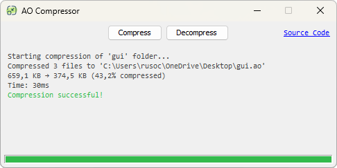

# AO Compressor

A GUI tool for compressing and decompressing Argentum Online resources into `.ao` files.

`.ao` files are standard ZIP files with UTF-8 encoding that contain game resources (images, sounds, etc.), preserved
folder structure, and compression metadata.



## Features

- **Compression**: Converts resource folders into compressed `.ao` files
- **Decompression**: Extracts `.ao` file contents to folders
- **Inspection**: Analyzes `.ao` file contents with detailed information:
    - Basic file information (size, date, SHA-256 hash)
    - List of contained files
    - Automatic file type detection by magic signatures
    - Compression ratios
    - Individual SHA-256 hashes
- **User-friendly interface**: Intuitive GUI with colorized logging and progress bar
- **Asynchronous processing**: Operations run in the background without blocking the interface
- **Security**: Protection against zip bombs and path traversal attacks

## Requirements

- **Java**: 17 or higher
- **Maven**: For compilation and dependency management

## Usage

### Main Interface

The application presents a window with three main buttons:

1. **Compress**: Compress a folder into an `.ao` file
2. **Decompress**: Extract an `.ao` file to a folder
3. **Inspect**: Analyze the contents of an `.ao` file

### Compression

1. Click **Compress**
2. Select the folder containing the resources to compress
3. Specify the location and name of the output `.ao` file
4. The application will process all files in the folder recursively

### Decompression

1. Click **Decompress**
2. Select the `.ao` file to extract
3. Select the destination folder where files will be extracted
4. Files will be extracted while maintaining the original folder structure

### Inspection

1. Click **Inspect**
2. Select the `.ao` file to analyze
3. The application will display detailed information about:
    - File metadata
    - List of contained files
    - Detected file types
    - Compression ratios
    - Hashes for integrity verification

## Project Structure

```
src/main/java/org/aocompressor/
├── App.java           # Main class with GUI
├── Compressor.java    # Compression/decompression logic
├── Inspector.java     # Inspection and analysis tools
├── MessageType.java   # Message types for logging
└── Utils.java         # General utilities
```

---

**Note**: `.ao` files are compatible with standard ZIP tools, but using this application is recommended to maintain full
compatibility with Argentum Online.